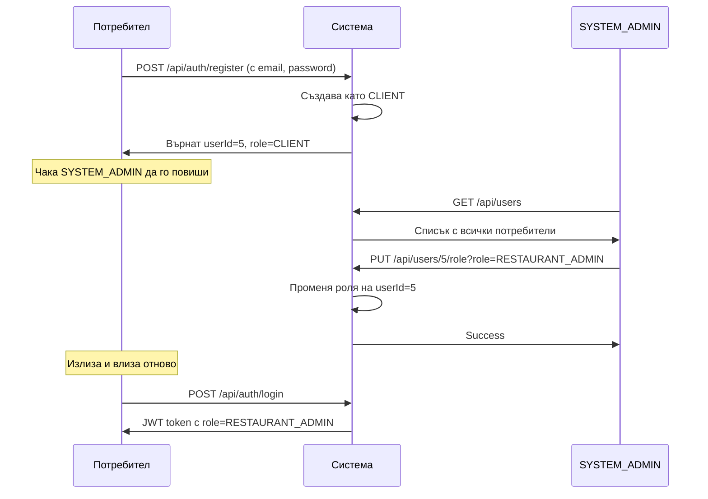
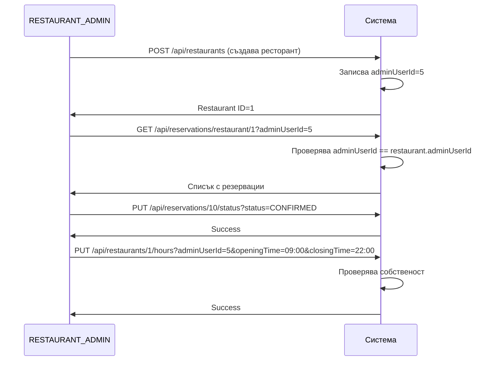
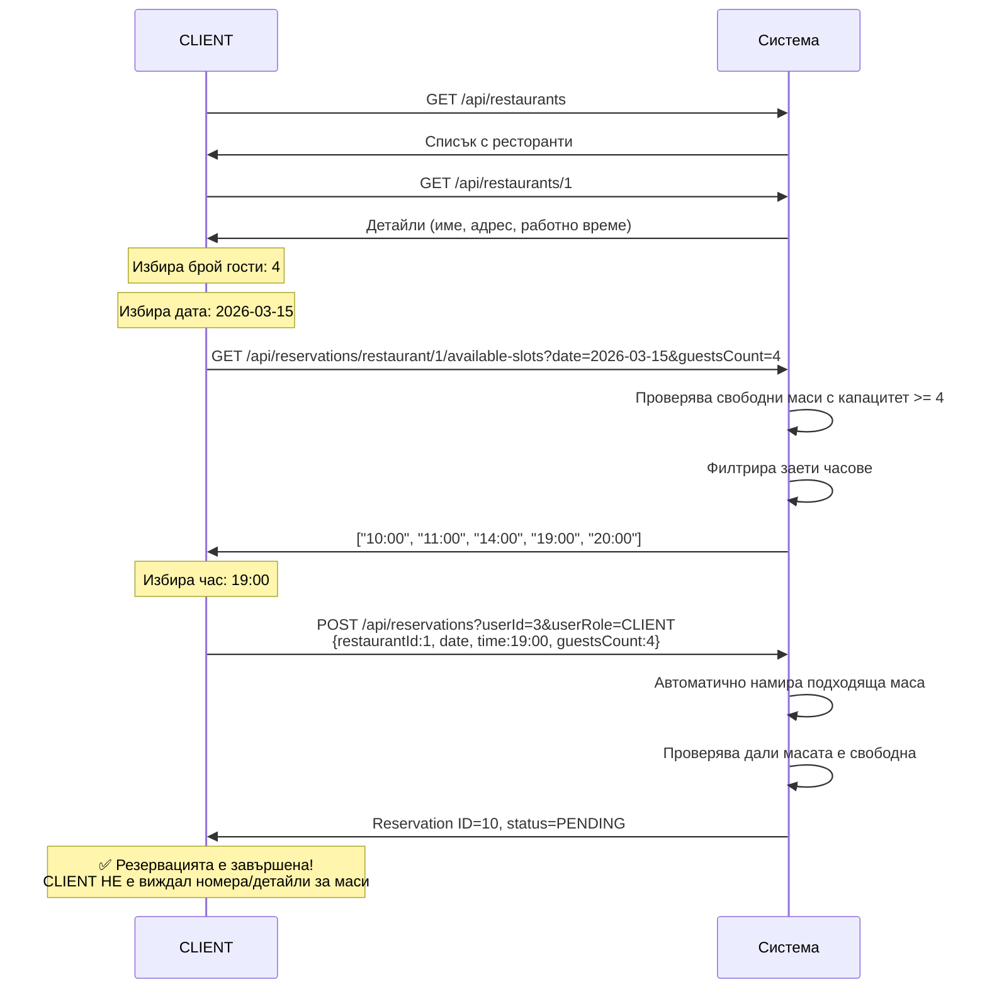
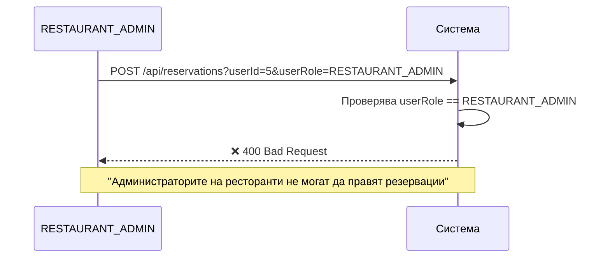

# Quick Table - Бизнес правила по роли

## Преглед

Тази система използва **3 роли** с ясно разделени отговорности:

1. **CLIENT** - Прави резервации
2. **RESTAURANT_ADMIN** - Управлява своя ресторант (НЕ прави резервации)
3. **SYSTEM_ADMIN** - Управлява потребители и системата

---

## Детайлни бизнес правила

### 1. CLIENT роля

#### Какво МОЖЕ да прави:
✅ Регистрира се в системата (автоматично като CLIENT)  
✅ Преглежда всички ресторанти  
✅ Вижда детайли за ресторант (име, адрес, работно време)  
✅ **Прави резервации** чрез избор на дата, час и брой гости  
✅ Вижда **само свободни времеви слотове** (НЕ вижда детайли за маси)  
✅ Вижда **само своите резервации**  
✅ Отменя своите резервации  
✅ Променя профила си (име, телефон)  

#### Какво НЕ МОЖЕ да прави:
❌ Вижда номера на маси, техния капацитет или локация  
❌ Избира конкретна маса (системата автоматично избира подходяща)  
❌ Вижда чужди резервации  
❌ Променя чужди резервации  
❌ Управлява ресторанти  
❌ Добавя маси  
❌ Променя роли на потребители  

#### API Endpoints:
- `POST /api/auth/register` - Регистрация (винаги CLIENT)
- `POST /api/auth/login` - Вход
- `GET /api/restaurants` - Списък с ресторанти
- `GET /api/restaurants/{id}` - Детайли за ресторант
- `GET /api/reservations/restaurant/{id}/available-slots?date={date}&guestsCount={count}&location={loc}` - **Свободни часове** (НЕ маси!)
- `POST /api/reservations?userId={id}&userRole=CLIENT` - Резервация (БЕЗ tableId, с locationPreference)
- `GET /api/reservations?userId={id}` - Моите резервации
- `PUT /api/reservations/{id}/status?status=CANCELLED` - Отмяна

---

### 2. RESTAURANT_ADMIN роля

#### Какво МОЖЕ да прави:
✅ Вижда **всички резервации за СВОЯ ресторант**  
✅ Потвърждава резервации (PENDING → CONFIRMED)  
✅ Отхвърля резервации (PENDING → REJECTED)  
✅ Променя работното време на ресторанта  
✅ Добавя нови маси  
✅ Затваря/отваря маси временно (available=true/false)  
✅ Променя детайли за своя ресторант (описание, телефон)  

#### Какво НЕ МОЖЕ да прави:
❌ **Прави резервации** (трябва да има отделен CLIENT акаунт)  
❌ Вижда чужди ресторанти и техните резервации  
❌ Променя настройки на други ресторанти  
❌ Променя роли на потребители  
❌ Вижда списък с всички потребители  

#### Защо не може да прави резервации?
**Бизнес логика:** RESTAURANT_ADMIN е собственик/мениджър на ресторант. Неговата роля е да **управлява** резервации, а не да прави такива. Ако той иска да резервира маса в друг ресторант (или дори в своя), трябва да използва отделен CLIENT акаунт.

**Алтернатива:** RESTAURANT_ADMIN може да има два акаунта:
1. **owner@restaurant.com** с роля RESTAURANT_ADMIN (за управление)
2. **owner-personal@mail.com** с роля CLIENT (за лични резервации)

#### API Endpoints:
- `GET /api/reservations/restaurant/{restaurantId}?adminUserId={id}` - Резервации за моя ресторант
- `PUT /api/reservations/{id}/status?status=CONFIRMED` - Потвърди резервация
- `PUT /api/reservations/{id}/status?status=REJECTED` - Откажи резервация
- `PUT /api/restaurants/{id}/hours?adminUserId={id}&openingTime={time}&closingTime={time}` - Промени часове
- `POST /api/restaurants/{id}/tables` - Добави маса
- `PUT /api/restaurants/{restaurantId}/tables/{tableNumber}/availability?available={bool}` - Отвори/затвори маса (по номер)
- `PUT /api/restaurants/{id}?adminUserId={id}` - Промени детайли

#### Валидация на собственост:
Всички endpoints проверяват:
```java
if (!restaurant.getAdminUserId().equals(adminUserId)) {
    throw new RuntimeException("Нямате права да променяте този ресторант");
}
```

---

### 3. SYSTEM_ADMIN роля

#### Какво МОЖЕ да прави:
✅ Вижда **всички потребители** в системата  
✅ Филтрира потребители по роля  
✅ **Променя роли на потребители** (CLIENT → RESTAURANT_ADMIN)  
✅ Вижда всички ресторанти  
✅ Добавя нови ресторанти  
✅ Супер администраторски права  

#### Какво НЕ МОЖЕ да прави:
❌ Сам да се регистрира през API (създава се чрез SQL скрипт)  

#### API Endpoints:
- `GET /api/users` - Всички потребители
- `GET /api/users?role=CLIENT` - Филтрирани по роля
- `GET /api/users?role=RESTAURANT_ADMIN` - Само RESTAURANT_ADMIN
- `PUT /api/users/{userId}/role?role={role}` - Промяна на роля
- `GET /api/restaurants` - Всички ресторанти
- `POST /api/restaurants` - Добави ресторант

#### Как се създава първият SYSTEM_ADMIN:
```sql
-- database-setup.sql
INSERT INTO users (email, password, first_name, last_name, phone_number, role, created_at)
VALUES (
    'admin@quicktable.com',
    '$2a$10$N9qo8uLOickgx2ZMRZoMye/JDhJvQqhxEhB8pP6bx4EsJ.3SdmGIK', -- admin123
    'Админ',
    'Администратор',
    '0888000000',
    'SYSTEM_ADMIN',
    CURRENT_TIMESTAMP
);
```

---

## Workflow-и

### Workflow 1: Създаване на RESTAURANT_ADMIN



### Workflow 2: RESTAURANT_ADMIN управлява ресторант



### Workflow 3: CLIENT прави резервация (нов UX)



### Workflow 4: RESTAURANT_ADMIN ОПИТА да прави резервация (ГРЕШКА)



---

## Validation правила в кода

### 1. Резервация само за CLIENT

**Файл:** `ReservationService.java`

```java
@Transactional
public ReservationResponse createReservation(Long userId, ReservationRequest request) {
    // BUSINESS RULE: RESTAURANT_ADMIN не може да прави резервации
    if (request.getUserRole() == UserRole.RESTAURANT_ADMIN) {
        throw new RuntimeException("Администраторите на ресторанти не могат да правят резервации. Използвайте CLIENT акаунт.");
    }
    
    // Продължи с резервацията...
}
```

### 2. Промяна на роля само от SYSTEM_ADMIN

**Файл:** `UserController.java`

```java
@PutMapping("/{userId}/role")
@PreAuthorize("hasRole('SYSTEM_ADMIN')")
public ResponseEntity<UserResponse> updateUserRole(
        @PathVariable Long userId,
        @RequestParam String role
) {
    UserRole userRole = UserRole.valueOf(role.toUpperCase());
    UserResponse response = userService.updateUserRole(userId, userRole);
    return ResponseEntity.ok(response);
}
```

### 3. Управление само на свой ресторант

**Файл:** `RestaurantService.java`

```java
@Transactional
public RestaurantResponse updateRestaurantHours(Long restaurantId, Long adminUserId, 
                                                LocalTime openingTime, 
                                                LocalTime closingTime) {
    Restaurant restaurant = restaurantRepository.findById(restaurantId)
            .orElseThrow(() -> new RuntimeException("Ресторант не е намерен"));

    // BUSINESS RULE: Само собственикът може да променя работното време
    if (!restaurant.getAdminUserId().equals(adminUserId)) {
        throw new RuntimeException("Нямате права да променяте работното време на този ресторант");
    }

    restaurant.setOpeningTime(openingTime);
    restaurant.setClosingTime(closingTime);
    return mapToResponse(restaurant, false);
}
```

---

## UI Mockups (Концептуално)

### SYSTEM_ADMIN: User Management екран

```
┌───────────────────────────────────────────────────────────────┐
│  Quick Table - User Management              [Filter: All ▼]   │
├────┬──────────────┬─────────────────┬──────────────┬──────────┤
│ ID │ Name         │ Email           │ Role         │ Actions  │
├────┼──────────────┼─────────────────┼──────────────┼──────────┤
│ 1  │ Admin        │ admin@qt.com    │ SYSTEM_ADMIN │ -        │
│ 2  │ Ivan Petrov  │ ivan@mail.com   │ CLIENT       │ [Change] │
│ 3  │ Maria        │ maria@mail.com  │ CLIENT       │ [Change] │
│ 4  │ Owner X      │ owner@rest.com  │ CLIENT       │ [Change] │
└────┴──────────────┴─────────────────┴──────────────┴──────────┘

[Change] бутон отваря модал:

┌────────────────────────────────────┐
│  Change Role for: Owner X          │
│                                    │
│  Current Role: CLIENT              │
│                                    │
│  New Role:  [RESTAURANT_ADMIN ▼]   │
│                                    │
│          [Cancel]   [Confirm]      │
└────────────────────────────────────┘
```

### RESTAURANT_ADMIN: Dashboard екран

```
┌─────────────────────────────────────────────────────────────┐
│  Restaurant Dashboard: Ресторант Копитото                   │
├─────────────────────────────────────────────────────────────┤
│  Статистики за днес:                                        │
│  📅 Резервации днес: 8                                      │
│  ✅ Потвърдени: 5                                           │
│  ⏳ Изчакващи: 3                                            │
│  🕐 Работно време: 10:00 - 23:00                            │
│                                                             │
│  [Виж Резервации]  [Управление на маси]  [Настройки]       │
└─────────────────────────────────────────────────────────────┘
```

### RESTAURANT_ADMIN опита да резервира (ГРЕШКА)

```
┌──────────────────────────────────────────────────────────────┐
│  ❌ Грешка                                                    │
├──────────────────────────────────────────────────────────────┤
│  Администраторите на ресторанти не могат да правят           │
│  резервации. Използвайте CLIENT акаунт за лични резервации.  │
│                                                              │
│  Съвет: Създайте си отделен CLIENT акаунт за лично          │
│  ползване на системата.                                      │
│                                                              │
│                          [OK]                                │
└──────────────────────────────────────────────────────────────┘
```

---

## Често задавани въпроси (FAQ)

### Q1: Защо RESTAURANT_ADMIN не може да прави резервации?

**A:** Това е бизнес правило за разделяне на отговорностите. RESTAURANT_ADMIN е **мениджър/собственик**, чиято работа е да **управлява** резервации, а не да прави такива. Ако той иска да резервира маса, трябва да използва CLIENT акаунт.

**Аналогия:** Мениджърът на хотел не използва recepcionist системата за личните си резервации - той има отделен акаунт като гост.

### Q2: Може ли един човек да има и двете роли?

**A:** Да, но в системата това са **два отделни акаунта**:
- `owner@restaurant.com` с роля RESTAURANT_ADMIN
- `owner-personal@mail.com` с роля CLIENT

### Q3: Как SYSTEM_ADMIN вижда кой да повиши до RESTAURANT_ADMIN?

**A:** Обикновено workflow-ът е:
1. Потребителят се регистрира като CLIENT
2. Свързва се с администратора (email, телефон)
3. Администраторът проверява данните
4. Администраторът влиза в системата, отваря User Management
5. Филтрира по email или име
6. Променя роля на потребителя

### Q4: Може ли RESTAURANT_ADMIN да вижда резервациите на друг ресторант?

**A:** НЕ. Системата валидира `adminUserId` за всяка заявка:

```java
if (!restaurant.getAdminUserId().equals(adminUserId)) {
    throw new RuntimeException("Нямате права");
}
```

### Q5: Какво се случва ако RESTAURANT_ADMIN опита да резервира маса?

**A:** Получава грешка 400 Bad Request:

```json
{
  "message": "Администраторите на ресторанти не могат да правят резервации. Използвайте CLIENT акаунт.",
  "timestamp": "2024-01-15T14:30:00",
  "path": "/api/reservations"
}
```

---

## Заключение

Тази система има ясно **разделение на отговорностите** по роли:

| Роля              | Управлява Потребители | Управлява Ресторанти | Прави Резервации | Вижда Резервации        |
|-------------------|----------------------|---------------------|-----------------|------------------------|
| CLIENT            | ❌                    | ❌                   | ✅               | Само свои              |
| RESTAURANT_ADMIN  | ❌                    | Само свой            | ❌               | Само за свой ресторант |
| SYSTEM_ADMIN      | ✅                    | Всички               | ❌ (не е нужно)  | Всички (ако е нужно)   |

**Ключови правила:**
- CLIENT прави резервации
- RESTAURANT_ADMIN управлява своя ресторант (НЕ прави резервации)
- SYSTEM_ADMIN управлява потребители и система

Това осигурява сигурност и ясна бизнес логика.
